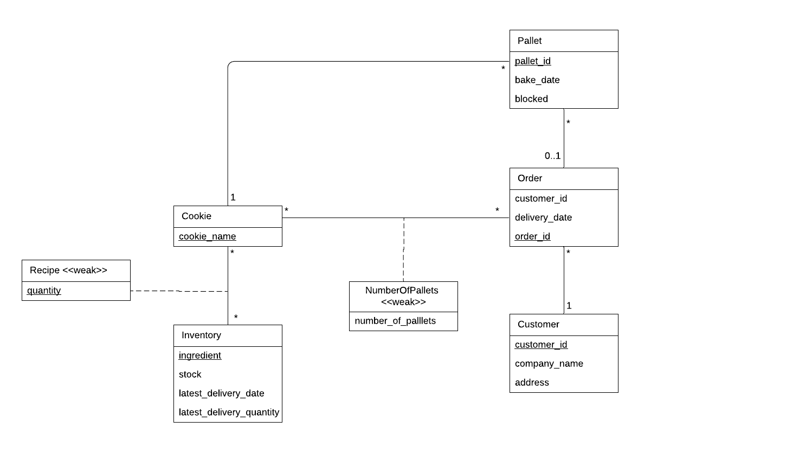

# EDAF75, project report group 40

This is the report for

 + Sepehr Tayari, `elt15sta`
 + Fabian Franken, `fa7320fr-s`
 + Albin Andersson, `al-0308an-s`


We solved this project on our own, except for:

 + Some feedback on our ER- model. Old version can be found somewhere in our old commits.
 + The test-script check.krustys.py which was provided on the project website. 


## ER-design

The model is in the file [`er_model.png`](er_model.png):

<center>
    
</center>

## Relations

The ER-model above gives the following relations:

+ cookies(**cookie_name**)
+ pallets(**pallet_id**, bake_date, blocked, _cookie_name_, _order_id_)
+ orders(**order_id**, delivery_date, _customer_id_)
+ inventories(**ingredient**, stock, unit, last_delivery_date, last_delivery_quant)
+ customers(**customer_id**, company_name, address)
+ recipes(_**ingredient**_, _**cookie_name**_, quantity)

## Scripts to set up database

The scripts used to set up and populate the database are in:

 + [`table_create.sql`](table_create.sql) (defines the tables), and
 + Insertion of data is done by calling the reset API-command.

So, to create and initialize the database, we run:

```shell
sqlite3 database.db < table_create.sql
```

## How to compile and run the program

To compile the project we run the api file with the following shell-commands.

```shell
python3 api_bakery.py
```
